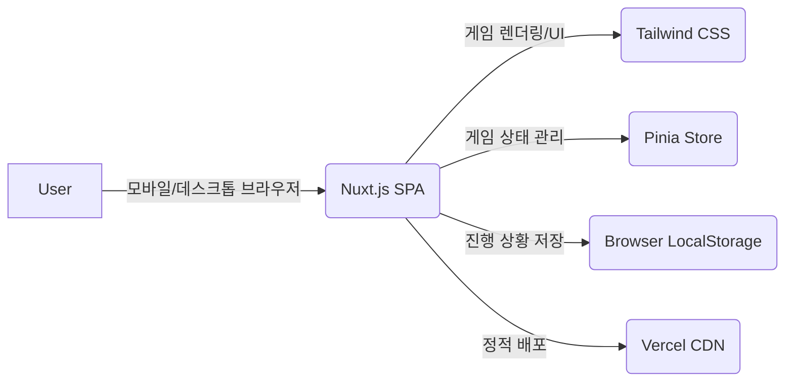
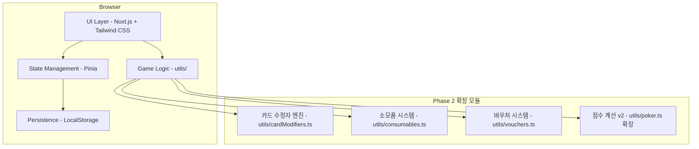
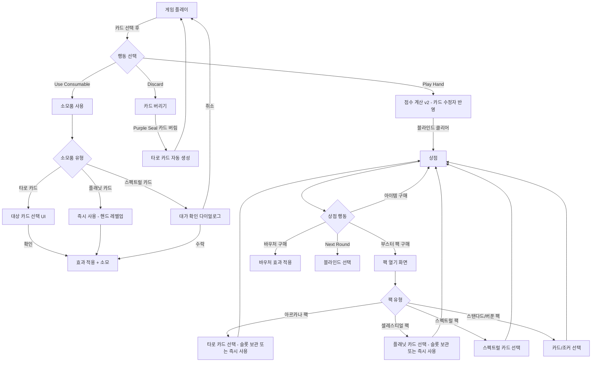
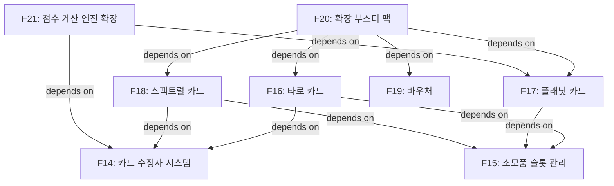

# Web Balatro Phase 2 ALPS

## Section 1. Overview

### 1.1. Purpose

- Phase 1에서 구현한 핵심 게임 루프(포커 핸드 → 점수 계산 → 상점 → 블라인드) 위에 **카드 수정자 시스템**(강화/에디션/인장), **소모품 카드**(타로/플래닛/스펙트럴), **바우처**, **확장 부스터 팩**을 추가한다
- 발라트로 원작의 전략적 깊이와 빌드 다양성을 재현하여 플레이어의 세션 시간 및 재방문율을 Phase 1 대비 유의미하게 향상시킨다

### 1.2. Document Title

- Web Balatro Phase 2 PRD

### 1.3. Author

- haandol

### 1.4. Target Users

- Phase 1을 경험하고 더 깊은 전략적 빌드를 원하는 기존 플레이어
- 덱 커스터마이징과 시너지 조합을 즐기는 로그라이크/카드 게임 팬

### 1.5. Core Problem

- Phase 1의 핵심 루프만으로는 빌드 다양성이 제한적이다 — 조커 조합 외에 덱 자체를 변형하거나 핸드 레벨을 성장시킬 수단이 없다
- 카드 수정자, 소모품, 바우처 없이는 원작 발라트로의 "무한한 조합"과 "중독성 있는 시너지 구축" 경험을 충분히 재현할 수 없다

### 1.6. Solution Strategy &amp; Differentiator

- **카드 수정자 시스템:** 강화(8종), 에디션(5종), 인장(4종)을 플레이 카드에 부여하여 카드 단위의 전략적 커스터마이징 제공
- **소모품 카드:** 타로(22종), 플래닛(12종), 스펙트럴(15종)로 즉각적인 덱 변형과 핸드 레벨 성장 경로 제공
- **바우처:** 32종 런 영구 특전으로 매 런마다 다른 전략 방향을 설정할 수 있는 메타 레이어 추가
- **확장 부스터 팩:** 아르카나/셀레스티얼/스펙트럴 팩 추가로 상점의 선택지와 긴장감 확대

### 1.7. Success Criteria

- 세션당 평균 플레이 시간 25분 이상 (Phase 1: 15분)
- 7일 내 재방문율 40% 이상 (Phase 1: 30%)
- 런당 평균 소모품 사용 5개 이상
- 런당 평균 바우처 구매 2개 이상

---

## Section 2. MVP Goals and Key Metrics

### 2.1. Core Hypothesis

- 카드 수정자(강화/에디션/인장), 소모품(타로/플래닛/스펙트럴), 바우처를 추가했을 때, 플레이어의 빌드 다양성이 증가하고 세션 시간 및 재방문율이 Phase 1 대비 유의미하게 향상되는가?

### 2.2. Key Performance Indicators (KPIs)

| KPI | Phase 1 기준값 | Phase 2 목표값 |
|:---|:---|:---|
| 세션당 평균 플레이 시간 | 15분 | ≥ 25분 |
| 7일 내 재방문율 | 30% | ≥ 40% |
| 런 완료율 (앤티 8 클리어) | 10% | ≥ 15% |
| 모바일 평균 FPS | 30fps | ≥ 30fps (유지) |
| 런당 평균 소모품 사용 수 | 0 (미구현) | ≥ 5개 |
| 런당 평균 바우처 구매 수 | 0 (미구현) | ≥ 2개 |

---

## Section 3. Demo Scenario

### 3.1. Demo Scenario

**시작점:** Phase 1이 완료된 상태에서, 사용자가 새로운 런을 시작한다.

**시나리오 흐름:**

1. **런 시작** — 표준 52장 덱, 핸드 4회, 디스카드 3회, $4 자금, 소모품 슬롯 2개로 게임 시작
2. **앤티 1 스몰/빅 블라인드 클리어** — Phase 1과 동일한 핵심 루프로 진행
3. **앤티 1 상점 — 아르카나 팩 구매** — 아르카나 팩($4)을 구매하여 타로 카드 3장 중 "The Star"(다이아몬드 변환)를 선택. 소모품 슬롯에 보관
4. **앤티 1 보스 블라인드 — 타로 카드 사용** — 블라인드 플레이 중 소모품 슬롯에서 The Star를 사용하여 손에 든 카드 3장을 다이아몬드로 변환. Greedy Joker 시너지 극대화로 높은 점수 달성
5. **앤티 2 상점 — 셀레스티얼 팩 + 바우처 구매** — 셀레스티얼 팩에서 Jupiter(플러시) 플래닛 카드 획득 → 즉시 사용 → 플러시 Lv.2로 영구 업그레이드. Wasteful 바우처($10)를 구매하여 라운드당 디스카드 영구 +1
6. **앤티 3~4 진행** — 추가 디스카드를 활용한 유연한 플레이. Purple Seal 카드를 버려 타로 카드 자동 생성. 상점에서 Bonus/Glass 강화가 적용된 카드를 발견하고 시너지 구축
7. **앤티 5 상점 — 스펙트럴 팩 도전** — 스펙트럴 팩에서 Wraith 사용 (희귀 조커 획득, 자금 $0) → 이자를 포기하는 고위험 전략 체험. 확인 다이얼로그에서 대가를 인지하고 결정
8. **데모 종료** — 앤티 5 클리어 시점에서 빌드 상태 요약: 조커 조합, 덱 내 강화/에디션/인장 카드 현황, 핸드 레벨, 보유 바우처

**종료점:** 사용자가 타로 카드로 덱을 커스터마이징하고, 플래닛 카드로 핸드를 성장시키며, 바우처로 런 전략을 형성하고, 스펙트럴 카드의 위험-보상을 체험

**검증 포인트:**
- 타로 카드에 의한 덱 변형이 전략적 재미를 제공하는지 → 세션 시간 25분+ 검증
- 플래닛 카드 레벨업에 따른 점수 성장 만족도 → 재방문율 40%+ 검증
- 바우처 선택에 따른 런 전략 분기 체감 → 런당 바우처 2개+ 검증
- 소모품 슬롯 관리의 전략적 고민 발생 여부 → 런당 소모품 5개+ 검증
- 모바일에서 카드 수정자 시각 효과가 30fps 이상으로 렌더링되는지 확인

---

## Section 4. High-Level Architecture

### 4.1. System Diagram



### 4.2. Container Diagram



### 4.3. Technology Stack

| Component | Technology | 비고 |
|:---|:---|:---|
| 프론트엔드 프레임워크 | Nuxt.js (SPA/CSR) | Phase 1과 동일 |
| 스타일링 | Tailwind CSS | Phase 1과 동일 |
| 상태 관리 | Pinia (Composition API) | 소모품/바우처/핸드 레벨 상태 추가 |
| 데이터 저장 | Browser LocalStorage | 저장 데이터 스키마 확장 |
| 배포 | Vercel | Phase 1과 동일 |

### 4.4. Architecture Decision

- **Phase 1 아키텍처 유지:** 서버 없이 순수 클라이언트 사이드 정적 배포. 새로운 인프라 추가 없음
- **게임 로직 모듈 분리:** 카드 수정자, 소모품, 바우처 로직을 각각 독립 유틸리티로 분리하여 테스트 용이성 확보
- **점수 계산 엔진 확장:** 기존 `calculateScore()` 를 카드 수정자/재트리거를 포함하는 v2로 확장. 하위 호환 유지
- **Phaser.js 미도입:** Phase 2에서도 Vue + CSS 애니메이션으로 카드 수정자 시각 효과 구현. 성능 병목 발생 시 Phase 3에서 Phaser.js 도입 검토

---

## Section 5. Design Specification

### 5.1. Key Screens

| 화면 | 주요 기능 | Feature ID |
|:---|:---|:---|
| 게임 플레이 (확장) | 소모품 슬롯 표시, 소모품 사용, 카드 수정자 시각 효과, 확장된 점수 계산 애니메이션 | F14, F15, F21 |
| 소모품 사용 | 타로 카드 대상 선택, 플래닛 카드 즉시 사용, 스펙트럴 카드 확인 다이얼로그 | F16, F17, F18 |
| 상점 (확장) | 바우처 슬롯 추가, 아르카나/셀레스티얼/스펙트럴 팩 판매, 타로/플래닛 개별 판매 | F19, F20 |
| 부스터 팩 열기 (확장) | 아르카나/셀레스티얼/스펙트럴 팩 열기 및 카드 선택 | F20 |
| 바우처 목록 | 현재 런에서 보유 중인 바우처 확인 패널 | F19 |

### 5.2. User Flow



**Phase 1 대비 주요 변경점:**
- 게임 플레이 화면에 소모품 슬롯 영역 추가
- "Use Consumable" 행동 추가 (핸드/디스카드 횟수 미소모)
- 타로 카드 사용 시 대상 카드 선택 서브 플로우
- 상점에 바우처 슬롯 + 확장 부스터 팩 추가
- 점수 계산 애니메이션에 카드 수정자 효과 단계 추가

---

## Section 6. Requirements Summary

### 6.1. Functional Requirements

| ID | Feature | Priority | 설명 |
|:---|:---|:---|:---|
| F14 | 카드 수정자 시스템 | Must-Have | 강화(8종), 에디션(5종), 인장(4종) 부여 및 점수 반영 인프라 |
| F15 | 소모품 슬롯 관리 | Must-Have | 타로/플래닛/스펙트럴 카드를 위한 인벤토리 (기본 2슬롯) |
| F16 | 타로 카드 | Must-Have | 22종 일회성 소모품 (카드 수정, 덱 조작, 자원 생성) |
| F17 | 플래닛 카드 | Must-Have | 10종 포커 핸드 레벨 영구 업그레이드 |
| F18 | 스펙트럴 카드 | Should-Have | 15종 고위험-고보상 소모품 (강력한 효과 + 대가) |
| F19 | 바우처 | Should-Have | 32종(16쌍) 런 영구 특전 |
| F20 | 확장 부스터 팩 | Must-Have | 아르카나/셀레스티얼/스펙트럴 팩 추가 |
| F21 | 점수 계산 엔진 확장 | Must-Have | 카드 수정자/재트리거를 반영한 점수 계산 고도화 |

### 6.2. Non-Functional Requirements

| ID | 요구사항 | 목표 |
|:---|:---|:---|
| NF1 | 모바일 성능 유지 | 카드 수정자 시각 효과 포함 평균 30fps 이상, 점수 계산 < 100ms |
| NF2 | 번들 크기 증가 제한 | Phase 1 대비 +20% 이내 |
| NF3 | 저장 데이터 하위 호환 | Phase 1 저장 데이터를 Phase 2로 마이그레이션 가능 |

### 6.3. Feature Dependency Diagram



**의존성 분석:**
- **F14 (카드 수정자)** — 루트 노드. F16(타로), F18(스펙트럴), F21(점수 확장)의 전제 조건
- **F15 (소모품 슬롯)** — 루트 노드. F16, F17, F18의 전제 조건
- **F20 (확장 팩)** — 리프 노드. 모든 소모품 + 바우처 구현 후 통합
- **F19 (바우처)** — 독립적이나 F20에서 참조됨

---

## Section 7. Feature-Level Specification

### 7.1. 카드 수정자 시스템 (F14)

> Feature ID: F14 | Priority: Must-Have

#### 7.1.1 User Story

- 플레이어로서, 플레이 카드에 강화/에디션/인장이 부여되어 카드마다 고유한 보너스를 가지므로, 개별 카드 단위의 전략적 커스터마이징을 할 수 있다

#### 7.1.2 UI Flow

1. 강화된 카드는 카드 배경색으로 구분 (예: Bonus=파랑, Mult=빨강, Glass=반투명, Gold=금색)
2. 에디션이 있는 카드는 반짝임/빛 효과로 구분 (Foil=은색 광택, Holographic=무지개 반사, Polychrome=색 변화)
3. 인장이 있는 카드는 카드 하단에 인장 아이콘 표시 (Gold=금 원, Blue=파랑 원, Red=빨강 원, Purple=보라 원)
4. 카드 탭 시 툴팁에 현재 부여된 수정자와 효과 설명 표시
5. 점수 계산 시 각 카드의 수정자 효과가 적용되는 순간 하이라이트 애니메이션

#### 7.1.3 Technical Description

**카드 데이터 모델 확장:**
```
PlayingCard { id, rank, suit, enhancement?, edition?, seal?, isDebuffed? }
```

**강화 (Enhancement) — 8종:**

| 강화 | 효과 | 트리거 | 특수 규칙 |
|:---|:---|:---|:---|
| Bonus Card | +30 칩 | 점수 기여 시 | — |
| Mult Card | +4 승수 | 점수 기여 시 | — |
| Wild Card | 모든 슈트로 간주 | 핸드 판별/조커 조건 시 | — |
| Glass Card | x2 승수 | 점수 기여 시 | 점수 후 1/4 확률 파괴 |
| Steel Card | x1.5 승수 | 손에 있는 동안 | 플레이하지 않아도 발동 |
| Stone Card | +50 칩 | 항상 | 랭크/슈트 없음, 핸드 판별 불참 |
| Gold Card | $3 | 라운드 종료 시 손에 있으면 | — |
| Lucky Card | 1/5 확률 +20 승수, 1/15 확률 +$20 | 점수 기여 시 | 두 효과 독립 판정 |

**에디션 (Edition) — 5종:**

| 에디션 | 효과 | 대상 |
|:---|:---|:---|
| Foil | +50 칩 | 플레이 카드, 조커 |
| Holographic | +10 승수 | 플레이 카드, 조커 |
| Polychrome | x1.5 승수 | 플레이 카드, 조커 |
| Negative | 조커 슬롯 +1 | 조커 전용 |
| Eternal | 판매/파괴 불가 | 조커 |

**인장 (Seal) — 4종:**

| 인장 | 효과 | 트리거 |
|:---|:---|:---|
| Gold Seal | $3 | 점수 기여 시 |
| Blue Seal | 플래닛 카드 생성 | 라운드 종료 시 손에 있으면 |
| Red Seal | 카드 효과 1회 재트리거 | 점수 계산 시 |
| Purple Seal | 타로 카드 생성 | 카드를 버릴 때 |

**수정자 공존 규칙:** 한 카드에 강화 1개 + 에디션 1개 + 인장 1개를 동시에 가질 수 있다. 새 강화 부여 시 기존 강화를 덮어쓴다.

#### 7.1.4 Edge Cases

- Glass Card 파괴 시 덱에서 영구 제거 — 덱 크기가 0이 되지 않도록 최소 1장 보호 필요 여부 검토
- Stone Card는 랭크/슈트가 없으므로 슈트 기반 보스 디버프(The Club 등)에 영향받지 않음
- Wild Card는 디버프된 슈트로도 간주됨 — 보스 블라인드 디버프 시 Wild Card도 디버프 대상
- Negative 에디션 조커 판매 시 슬롯 -1 — 슬롯 수가 현재 장착 조커 수 이하가 될 수 있음 → 초과 조커 강제 판매 없이 슬롯만 감소, 새 조커 획득만 불가
- Blue/Purple Seal이 소모품 슬롯 가득 찬 상태에서 트리거 → 카드 생성 실패, 알림 표시

#### 7.1.5 Error Handling

| 상황 | 처리 |
|:---|:---|
| 이미 강화된 카드에 새 강화 부여 | 기존 강화 덮어쓰기 (경고 없이) |
| Eternal 조커 판매 시도 | 판매 버튼 비활성화 + "Eternal 조커는 판매할 수 없습니다" 메시지 |
| 소모품 슬롯 부족으로 Seal 효과 실패 | "소모품 슬롯이 가득 차 카드를 생성할 수 없습니다" 알림 |
| Glass Card 파괴 시 | 파괴 애니메이션 후 덱에서 제거, 카드 수 업데이트 |

#### 7.1.6 Acceptance Criteria

- [ ] 카드에 강화/에디션/인장을 각각 하나씩 부여할 수 있다
- [ ] 강화/에디션/인장이 동시에 한 카드에 공존할 수 있다
- [ ] 각 수정자의 효과가 정확한 트리거 시점에 발동한다
- [ ] Wild Card가 모든 슈트 조건을 만족시킨다
- [ ] Glass Card가 점수 획득 후 1/4 확률로 파괴된다
- [ ] Steel Card가 손에 있는 동안 점수에 기여한다
- [ ] Stone Card가 랭크/슈트 없이 +50 칩만 기여한다
- [ ] Red Seal이 카드 효과를 재트리거한다
- [ ] Gold/Blue/Purple Seal이 정확한 시점에 발동한다
- [ ] 카드 수정자가 시각적으로 구분된다
- [ ] Negative 조커가 슬롯 +1을 제공하고 판매 시 -1된다
- [ ] Eternal 조커가 판매/파괴 불가하다

### 7.2. 소모품 슬롯 관리 (F15)

> Feature ID: F15 | Priority: Must-Have

#### 7.2.1 User Story

- 플레이어로서, 타로/플래닛/스펙트럴 카드를 소모품 슬롯에 보관하고 원하는 시점에 사용할 수 있으므로, 전략적 타이밍에 소모품을 활용할 수 있다

#### 7.2.2 UI Flow

1. 게임 플레이 화면 상단에 조커 슬롯 옆으로 소모품 슬롯(기본 2개) 표시
2. 소모품 카드 탭 → 효과 설명 툴팁 + "Use" 버튼
3. "Use" 탭 → 소모품 유형에 따라 즉시 사용 또는 대상 선택 UI 전환
4. 사용 완료 → 슬롯에서 제거
5. 소모품 길게 누르기 → "Sell" 옵션 (판매 가격 표시)
6. 슬롯이 가득 찬 상태에서 새 소모품 획득 시도 → "슬롯이 가득 찼습니다" 알림

#### 7.2.3 Technical Description

**소모품 데이터 모델:**
```
ConsumableCard { id, type: 'tarot' | 'planet' | 'spectral', name, description, effect, edition? }
```

**Pinia store 확장:**
- `consumableSlots: number` — 기본 2, 바우처(Crystal Ball)로 +1
- `consumables: ConsumableCard[]` — 현재 보유 소모품

**사용 시점 규칙:**
- 블라인드 플레이 중: 핸드 플레이/디스카드 대신 소모품 사용 가능 (핸드/디스카드 횟수 미소모)
- 부스터 팩 열기 시: 아르카나/셀레스티얼/스펙트럴 팩에서 획득 즉시 사용 가능 (슬롯 불필요)

**판매 가격:** 소모품 기본 가격의 절반 (타로 $1, 플래닛 $1, 스펙트럴 $2)

#### 7.2.4 Edge Cases

- 소모품 슬롯이 가득 찬 상태에서 Blue Seal/Purple Seal 트리거 → 카드 생성 스킵, 알림
- 부스터 팩에서 소모품 선택 시 슬롯이 가득 차면 → "즉시 사용" 또는 "포기" 선택지 제공
- 바우처(Crystal Ball)로 슬롯 +1 후 소모품 3개 보유 → Crystal Ball 효과는 영구이므로 슬롯 감소 없음
- 소모품을 보유한 채 런 종료 → 사용하지 않은 소모품은 소멸 (런 단위 아이템)

#### 7.2.5 Error Handling

| 상황 | 처리 |
|:---|:---|
| 슬롯 가득 찬 상태에서 소모품 획득 시도 | "소모품 슬롯이 가득 찼습니다" 알림, 획득 차단 |
| 사용 대상이 없는 타로 카드 사용 시도 | "사용할 수 있는 대상 카드가 없습니다" 알림 |
| 블라인드 선택 화면에서 소모품 사용 시도 | Use 버튼 비활성화 (블라인드 플레이 중에만 사용 가능) |

#### 7.2.6 Acceptance Criteria

- [ ] 기본 2개 소모품 슬롯이 제공된다
- [ ] 소모품을 슬롯에 보관하고 원하는 시점에 사용할 수 있다
- [ ] 슬롯이 가득 차면 새 소모품을 획득할 수 없다
- [ ] 소모품 사용 시 핸드/디스카드 횟수가 소모되지 않는다
- [ ] 소모품 탭 시 효과 설명이 표시된다
- [ ] 소모품을 판매할 수 있다
- [ ] 바우처에 의해 슬롯 수가 증가할 수 있다

### 7.3. 타로 카드 (F16)

## 7.3 타로 카드 (F16)

### User Story
플레이어로서, 타로 카드를 사용하여 핸드에 있는 카드를 수정(Enhancement/Edition/Seal 부여, 수트 변환, 덱 조작)함으로써, 전략적 덱 빌딩을 할 수 있다.

### Technical Description
22종의 타로 카드를 소모품 시스템(F15)과 연동하여 구현한다. 각 타로 카드는 선택된 카드에 대해 고유한 효과를 적용하며, 카드 수정자 시스템(F14)을 통해 Enhancement/Edition/Seal을 부여한다.

### 타로 카드 목록

#### 1. 카드 수정 (Enhancement 부여) — 8종

| 카드명 | 효과 | 대상 선택 |
|--------|------|-----------|
| The Magician | 선택 카드 1~2장에 Lucky Enhancement 부여 | 1~2장 |
| The Empress | 선택 카드 1~2장에 Mult Enhancement 부여 | 1~2장 |
| The Hierophant | 선택 카드 1~2장에 Bonus Enhancement 부여 | 1~2장 |
| The Lovers | 선택 카드 1장에 Wild Enhancement 부여 | 1장 |
| The Chariot | 선택 카드 1장에 Steel Enhancement 부여 | 1장 |
| Justice | 선택 카드 1장에 Glass Enhancement 부여 | 1장 |
| The Devil | 선택 카드 1장에 Gold Enhancement 부여 | 1장 |
| The Tower | 선택 카드 1장에 Stone Enhancement 부여 | 1장 |

#### 2. 수트 변환 — 4종

| 카드명 | 효과 | 대상 선택 |
|--------|------|-----------|
| The Star | 선택 카드 1~3장의 수트를 Diamond로 변환 | 1~3장 |
| The Moon | 선택 카드 1~3장의 수트를 Club으로 변환 | 1~3장 |
| The Sun | 선택 카드 1~3장의 수트를 Heart로 변환 | 1~3장 |
| The World | 선택 카드 1~3장의 수트를 Spade로 변환 | 1~3장 |

#### 3. 덱 조작 — 3종

| 카드명 | 효과 | 대상 선택 |
|--------|------|-----------|
| The Fool | 마지막에 사용한 타로/플래닛 카드의 복사본 생성 | 없음 (자동) |
| The Hanged Man | 선택 카드 최대 2장을 덱에서 영구 삭제 | 1~2장 |
| Death | 선택 카드 2장 중 왼쪽 카드를 오른쪽 카드의 복사본으로 변환 (수트+랭크) | 정확히 2장 |

#### 4. 리소스 생성 — 5종

| 카드명 | 효과 | 대상 선택 |
|--------|------|-----------|
| The High Priestess | 소모품 슬롯에 랜덤 플래닛 카드 최대 2장 생성 | 없음 (자동) |
| The Emperor | 소모품 슬롯에 랜덤 타로 카드 최대 2장 생성 | 없음 (자동) |
| Temperance | 보유 조커들의 판매가 합계만큼 $획득 (최대 $50) | 없음 (자동) |
| The Hermit | 현재 보유 금액을 2배로 증가 (최대 $20 획득) | 없음 (자동) |
| Wheel of Fortune | 1/4 확률로 랜덤 조커에 Foil/Holo/Polychrome Edition 부여 | 없음 (확률) |

#### 5. 조커 수정 — 1종

| 카드명 | 효과 | 대상 선택 |
|--------|------|-----------|
| Strength | 선택 카드 최대 2장의 랭크를 1단계 올림 (K→A 순환) | 1~2장 |

### 타로 카드 사용 Flow

```
1. 소모품 슬롯에서 타로 카드 선택
2. 대상 선택이 필요한 경우:
   a. 핸드에서 유효한 대상 카드 선택 (최소/최대 제한 적용)
   b. "Use" 버튼 활성화
3. 대상 선택이 불필요한 경우 (자동 효과):
   a. 즉시 "Use" 버튼 활성화
4. 효과 적용 → 타로 카드 소모 (슬롯에서 제거)
5. 시각적 피드백 (카드 변환 애니메이션)
```

### 구현 구조

```typescript
// types/consumable.ts
interface TarotCard {
  id: string;                    // 'the_magician', 'the_empress', ...
  name: string;
  type: 'tarot';
  targetType: 'select_cards' | 'auto' | 'random';
  minTargets?: number;           // 카드 선택 최소 수
  maxTargets?: number;           // 카드 선택 최대 수
  effect: TarotEffect;
}

type TarotEffect =
  | { type: 'add_enhancement'; enhancement: EnhancementType }
  | { type: 'change_suit'; suit: Suit }
  | { type: 'destroy_cards' }
  | { type: 'copy_card' }
  | { type: 'generate_consumable'; consumableType: 'tarot' | 'planet'; count: number }
  | { type: 'gain_money'; calcType: 'joker_sell_value' | 'double_money'; cap: number }
  | { type: 'add_edition_random'; odds: number }
  | { type: 'rank_up' }
  | { type: 'copy_last_consumable' };

// utils/tarot.ts — 순수 함수
function applyTarotEffect(card: TarotCard, targets: PlayingCard[], state: GameState): TarotResult;
function getValidTargets(card: TarotCard, hand: PlayingCard[]): PlayingCard[];
function isValidSelection(card: TarotCard, selected: PlayingCard[]): boolean;
```

### Edge Cases

| 상황 | 처리 |
|------|------|
| 소모품 슬롯이 가득 찬 상태에서 High Priestess/Emperor 사용 | 빈 슬롯 수만큼만 생성 (0개면 효과 없음, 카드는 소모) |
| The Fool 사용 시 이전에 사용한 타로/플래닛이 없음 | 카드 사용 불가 (비활성 처리) |
| Death로 동일한 카드 2장 선택 | 정상 동작 — 왼쪽이 오른쪽의 복사본이 됨 (같은 카드면 변화 없음) |
| Wheel of Fortune 실패 (3/4 확률) | "Nope!" 메시지 표시, 카드는 소모됨 |
| Glass Enhancement 카드가 파괴될 때 | 1/4 확률로 파괴, 덱에서 영구 제거 |
| Hanged Man으로 핸드의 마지막 카드 삭제 시도 | 최소 덱 크기 제한 없음 (원작 동일) |
| Strength로 K 랭크 카드 선택 | A로 순환 (K→A) |

### Error Handling

| 에러 상황 | 처리 방법 |
|-----------|-----------|
| 대상 카드 수가 범위 밖 | "Use" 버튼 비활성화, 선택 범위 안내 표시 |
| 이미 같은 Enhancement가 있는 카드에 같은 타로 사용 | 정상 적용 (덮어쓰기, 변화 없음) |
| 소모품 슬롯 빈자리 없이 생성형 타로 사용 | 가능한 만큼만 생성, 나머지 무시 |
| 타로 카드 효과 적용 중 상태 불일치 | 효과 적용을 atomic하게 처리, 실패 시 롤백 |

### Acceptance Criteria

- [ ] 22종 타로 카드가 모두 정의되고 고유 효과가 동작한다
- [ ] 카드 선택 UI가 타로별 최소/최대 대상 수를 올바르게 제한한다
- [ ] Enhancement/Edition/Seal 부여가 F14 카드 수정자 시스템과 연동된다
- [ ] 수트 변환 시 카드 시각적 표시가 즉시 업데이트된다
- [ ] 리소스 생성 타로가 소모품 슬롯 잔여 공간을 올바르게 체크한다
- [ ] 타로 카드 사용 후 소모품 슬롯에서 제거된다
- [ ] The Fool이 마지막 사용 소모품을 정확히 추적하고 복사한다
- [ ] Wheel of Fortune의 확률 판정이 올바르게 동작한다
- [ ] 모든 Edge Case가 크래시 없이 처리된다

### 7.4. 플래닛 카드 (F17)

## 7.4 플래닛 카드 (F17)

### User Story
플레이어로서, 플래닛 카드를 사용하여 특정 포커 핸드의 기본 칩/승수를 영구적으로 업그레이드함으로써, 선호하는 핸드 유형을 강화하는 빌드 전략을 구사할 수 있다.

### Technical Description
10종의 플래닛 카드를 소모품 시스템(F15)과 연동하여 구현한다. 사용 시 대상 포커 핸드의 레벨이 1 증가하며, 레벨에 비례하여 기본 칩/승수가 영구 증가한다. Phase 1에서 고정(Lv.1)이었던 핸드 기본값을 동적 레벨 시스템으로 전환한다.

### 핸드 레벨 시스템

Phase 1에서 고정(Lv.1)이었던 핸드 레벨을 동적으로 만든다.

```typescript
interface HandLevel {
  level: number      // 초기 1
  baseChips: number  // 핸드 유형별 초기값
  baseMult: number   // 핸드 유형별 초기값
}

type HandLevelMap = Record<PokerHandType, HandLevel>
```

### 플래닛 카드 목록 (10종)

| 플래닛 카드 | 대상 핸드 | Lv.1 칩/승수 | 레벨당 칩 증가 | 레벨당 승수 증가 |
|-------------|-----------|-------------|--------------|----------------|
| Pluto | 하이 카드 | 5 / 1 | +10 | +1 |
| Mercury | 원 페어 | 10 / 2 | +15 | +1 |
| Uranus | 투 페어 | 20 / 2 | +20 | +1 |
| Venus | 쓰리 오브 어 카인드 | 30 / 3 | +20 | +2 |
| Earth | 스트레이트 | 30 / 4 | +30 | +3 |
| Jupiter | 플러시 | 35 / 4 | +15 | +2 |
| Saturn | 풀 하우스 | 40 / 4 | +25 | +2 |
| Mars | 포 오브 어 카인드 | 60 / 7 | +30 | +3 |
| Neptune | 스트레이트 플러시 | 100 / 8 | +40 | +4 |
| Planet X | 로얄 플러시 | 100 / 8 | +40 | +4 |

> **특수 플래닛 카드 (2종, Phase 3 예정):** Ceres(Five of a Kind), Eris(Flush Five)는 해당 고유 핸드를 Phase 3에서 구현 후 추가.

### 레벨 계산 공식

```typescript
// 특정 핸드 타입의 현재 칩/승수 계산
function getHandBaseValues(handType: PokerHandType, handLevels: HandLevelMap): { chips: number; mult: number } {
  const level = handLevels[handType];
  return {
    chips: level.baseChips,  // 초기값 + (level - 1) * 레벨당 증가치
    mult: level.baseMult     // 초기값 + (level - 1) * 레벨당 증가치
  };
}

// 플래닛 카드 사용 시
function applyPlanetCard(handType: PokerHandType, handLevels: HandLevelMap): HandLevelMap {
  const current = handLevels[handType];
  const config = PLANET_CARD_CONFIG[handType];
  return {
    ...handLevels,
    [handType]: {
      level: current.level + 1,
      baseChips: current.baseChips + config.chipsPerLevel,
      baseMult: current.baseMult + config.multPerLevel,
    }
  };
}
```

### 사용 Flow

```
1. 소모품 슬롯에서 플래닛 카드 선택
2. 대상 핸드 유형과 레벨업 효과 미리보기 표시
3. "Use" 버튼 탭 → 즉시 사용 (대상 카드 선택 불필요)
4. 핸드 레벨 +1, 기본 칩/승수 영구 증가
5. 핸드 정보 UI에 업데이트된 레벨과 수치 반영
6. 플래닛 카드 소모 (슬롯에서 제거)
```

### 구현 구조

```typescript
// types/consumable.ts
interface PlanetCard {
  id: string;              // 'pluto', 'mercury', ...
  name: string;
  type: 'planet';
  targetHand: PokerHandType;
  chipsPerLevel: number;
  multPerLevel: number;
}

// data/planets.ts — 정적 데이터
const PLANET_CARDS: PlanetCard[] = [
  { id: 'pluto', name: 'Pluto', type: 'planet', targetHand: 'high_card', chipsPerLevel: 10, multPerLevel: 1 },
  // ...
];

// utils/planet.ts — 순수 함수
function applyPlanetEffect(card: PlanetCard, handLevels: HandLevelMap): HandLevelMap;
function getPlanetDescription(card: PlanetCard, currentLevel: HandLevel): string;
```

### 획득 경로

| 경로 | 설명 |
|------|------|
| 셀레스티얼 팩 | 주요 획득 경로 |
| Blue Seal | 라운드 종료 시 손에 Blue Seal 카드가 있으면 해당 핸드의 플래닛 카드 생성 |
| The High Priestess (타로) | 랜덤 플래닛 카드 최대 2장 생성 |
| 상점 개별 판매 | 바우처(Planet Merchant/Planet Tycoon) 보유 시 상점에 출현 |
| Telescope 바우처 | 셀레스티얼 팩에서 가장 많이 플레이한 핸드의 플래닛 카드 보장 |

### 핸드 정보 UI 변경

```
Phase 1: "Pair — 10 chips, x2 mult"
Phase 2: "Pair Lv.3 — 40 chips, x4 mult (next: +15 chips, +1 mult)"
```

- 핸드 정보 패널에 현재 레벨, 칩/승수 수치, 다음 레벨업 증가치 표시
- 레벨업 직후 하이라이트 애니메이션

### Edge Cases

| 상황 | 처리 |
|------|------|
| 핸드 레벨 상한 | 상한 없음 (원작 동일) |
| Black Hole 스펙트럴 카드 사용 | 모든 핸드 레벨 +1 (10종 모두 적용) |
| The Fool로 마지막 사용 플래닛 카드 복사 | 정상 동작 — 동일 플래닛 카드 복사본 생성 |
| 소모품 슬롯이 가득 찬 상태에서 Blue Seal 트리거 | 플래닛 카드 생성 실패, 슬롯 부족 알림 |
| 한 번도 플레이하지 않은 핸드의 Telescope 처리 | 가장 많이 플레이한 핸드 기준 — 모두 0이면 랜덤 |

### Error Handling

| 에러 상황 | 처리 방법 |
|-----------|-----------|
| 핸드 레벨 데이터 누락 | 기본값(Lv.1)으로 초기화 |
| 저장 데이터에 새로운 핸드 타입 추가 | 마이그레이션 시 기본 레벨로 초기화 |
| 플래닛 카드 사용 중 상태 불일치 | atomic 업데이트, 실패 시 롤백 |

### Acceptance Criteria

- [ ] 10종 플래닛 카드가 모두 정의되고 사용 가능하다
- [ ] 플래닛 카드 사용 시 대상 핸드의 레벨이 1 증가한다
- [ ] 레벨 증가에 따라 기본 칩/승수가 정확한 수치만큼 증가한다
- [ ] 핸드 레벨이 점수 계산(F21)에 정확히 반영된다
- [ ] 핸드 정보 UI에 현재 레벨, 수치, 다음 레벨업 정보가 표시된다
- [ ] 핸드 레벨이 런 상태 저장(F13)에 포함된다
- [ ] 모든 획득 경로(셀레스티얼 팩, Blue Seal, 타로, 상점)에서 정상 획득된다
- [ ] 대상 카드 선택 없이 즉시 사용된다
- [ ] 사용 후 소모품 슬롯에서 제거된다

### 7.5. 스펙트럴 카드 (F18)

## 7.5 스펙트럴 카드 (F18)

### User Story
플레이어로서, 스펙트럴 카드를 사용하여 강력한 효과(희귀 조커 생성, 에디션 부여, 대량 덱 수정)를 얻되 무거운 대가(자금 소실, 카드 파괴, 핸드 크기 감소)를 감수함으로써, 고위험-고보상의 전략적 결단을 경험할 수 있다.

### Technical Description
15종의 스펙트럴 카드를 소모품 시스템(F15)과 연동하여 구현한다. 대부분의 스펙트럴 카드는 강력한 효과와 함께 돌이킬 수 없는 대가를 수반하므로, 사용 전 확인 다이얼로그를 통해 대가를 명확히 안내한다.

### 스펙트럴 카드 목록 (15종)

#### 1. 덱 추가/수정 — 4종

| 카드명 | 효과 | 대가 |
|--------|------|------|
| Familiar | 강화된 랜덤 페이스 카드(J/Q/K) 3장을 손에 추가 | 손에 든 랜덤 카드 1장 파괴 |
| Grim | 강화된 랜덤 에이스 3장을 손에 추가 | 손에 든 랜덤 카드 1장 파괴 |
| Incantation | 강화된 랜덤 넘버 카드(2~10) 4장을 손에 추가 | 손에 든 랜덤 카드 1장 파괴 |
| Cryptid | 선택한 카드 1장의 복사본 2장을 덱에 추가 | — |

#### 2. 카드 수정자 부여 — 2종

| 카드명 | 효과 | 대가 |
|--------|------|------|
| Talisman | 선택한 카드 1장에 Gold Seal 추가 | — |
| Aura | 선택한 카드 1장에 Foil/Holographic/Polychrome 중 랜덤 에디션 추가 | — |

#### 3. 조커 관련 — 4종

| 카드명 | 효과 | 대가 |
|--------|------|------|
| Wraith | 랜덤 희귀(Rare) 조커 1장 생성 | 보유 자금을 **$0**으로 |
| Ectoplasm | 랜덤 조커에 Negative 에디션 추가 (조커 슬롯 +1) | 핸드 크기 영구 **-1** |
| Ankh | 랜덤 조커 1장의 **복사본** 생성 | 다른 **모든 조커** 파괴 |
| Hex | 랜덤 조커에 Polychrome 에디션 추가 | 다른 **모든 조커** 파괴 |

#### 4. 대규모 변환 — 2종

| 카드명 | 효과 | 대가 |
|--------|------|------|
| Sigil | 손에 든 모든 카드의 수트를 랜덤 1개 수트로 통일 | — |
| Ouija | 손에 든 모든 카드의 랭크를 랜덤 1개 랭크로 통일 | 핸드 크기 영구 **-1** |

#### 5. 자원/특수 — 3종

| 카드명 | 효과 | 대가 |
|--------|------|------|
| Immolate | $20 획득 | 손에 든 랜덤 카드 **5장** 파괴 |
| Black Hole | **모든** 포커 핸드를 1레벨 업그레이드 | — |
| Soul | **전설(Legendary) 조커** 1장 생성 | — (극히 희귀) |

### 사용 전 확인 UI

대가가 있는 스펙트럴 카드 사용 시 확인 다이얼로그 표시:

```
┌─────────────────────────────────────┐
│         ⚠️  Wraith 사용             │
│                                     │
│  효과: 희귀 조커 1장 생성           │
│  대가: 보유 자금이 $0이 됩니다      │
│                                     │
│  현재 보유: $47                      │
│                                     │
│     [취소]         [사용]           │
└─────────────────────────────────────┘
```

- 대가가 없는 카드(Cryptid, Talisman, Aura, Black Hole, Soul): 확인 없이 바로 사용
- 대가가 있는 카드: 효과 + 대가 + 현재 상태를 표시한 뒤 사용자 확인

### 구현 구조

```typescript
// types/consumable.ts
interface SpectralCard {
  id: string;
  name: string;
  type: 'spectral';
  targetType: 'select_cards' | 'auto';
  minTargets?: number;
  maxTargets?: number;
  effect: SpectralEffect;
  penalty?: SpectralPenalty;
  requiresConfirmation: boolean;
}

type SpectralEffect =
  | { type: 'add_random_cards'; cardFilter: 'face' | 'ace' | 'number'; count: number; enhanced: boolean }
  | { type: 'copy_to_deck'; copies: number }
  | { type: 'add_seal'; seal: Seal }
  | { type: 'add_random_edition' }
  | { type: 'create_joker'; rarity: 'rare' | 'legendary' }
  | { type: 'add_negative_edition' }
  | { type: 'copy_joker' }
  | { type: 'add_polychrome_edition' }
  | { type: 'unify_suit' }
  | { type: 'unify_rank' }
  | { type: 'gain_money'; amount: number }
  | { type: 'level_all_hands' }

type SpectralPenalty =
  | { type: 'destroy_random_hand_cards'; count: number }
  | { type: 'set_money_zero' }
  | { type: 'reduce_hand_size'; amount: number }
  | { type: 'destroy_other_jokers' }

// utils/spectral.ts — 순수 함수
function applySpectralEffect(card: SpectralCard, targets: PlayingCard[], state: GameState): SpectralResult;
function applySpectralPenalty(penalty: SpectralPenalty, state: GameState): GameState;
function getConfirmationMessage(card: SpectralCard, state: GameState): string;
```

### 획득 경로

| 경로 | 설명 |
|------|------|
| 스펙트럴 팩 | 주요 획득 경로 (2장 중 1선택 / 4장 중 1~2선택) |
| Omen Globe 바우처 | 아르카나 팩에서 스펙트럴 카드 출현 가능 |

### Eternal 조커 상호작용

- Ankh, Hex 사용 시 "다른 모든 조커 파괴" 효과에서 **Eternal 에디션 조커는 제외**
- Eternal 조커만 남는 경우에도 정상 동작 (파괴 가능한 조커만 파괴)

### Edge Cases

| 상황 | 처리 |
|------|------|
| Wraith 사용 시 이미 $0 | 정상 동작 — $0 유지, 희귀 조커 생성 |
| Ankh/Hex 사용 시 조커가 1개만 있음 | Ankh: 복사 후 파괴할 대상 없음 (복사본만 남음). Hex: 대상 조커에 Polychrome 부여, 파괴 대상 없음 |
| Ankh/Hex 사용 시 모든 조커가 Eternal | 파괴 가능한 조커 없음 — Eternal 조커 모두 유지 |
| Ectoplasm/Ouija 반복 사용으로 핸드 크기 0 이하 | 핸드 크기 최소 1 제한 |
| Immolate 사용 시 손에 카드가 5장 미만 | 가진 카드 전부 파괴 |
| Soul 카드 출현 확률 | 극히 희귀 — 스펙트럴 팩에서만 낮은 확률로 출현 |
| Familiar/Grim/Incantation 추가 카드에 랜덤 Enhancement 부여 | 8종 Enhancement 중 랜덤 1개 |
| Cryptid 선택 카드의 수정자(Enhancement/Edition/Seal) | 복사본에 모든 수정자 그대로 복사 |
| Sigil/Ouija 사용 후 Wild Card가 있는 경우 | Wild Card도 수트/랭크 통일 적용 (Wild 속성은 유지) |

### Error Handling

| 에러 상황 | 처리 방법 |
|-----------|-----------|
| 조커 슬롯 부족으로 Wraith/Soul/Ankh 생성 불가 | 조커 슬롯이 없으면 사용 불가 (비활성 처리) |
| 대상 카드 선택 수 부족 | "Use" 버튼 비활성화 |
| 복사 대상 조커가 없음 (Ankh) | 효과 없음, 카드만 소모 |
| 스펙트럴 카드 효과 중 상태 불일치 | 효과 + 대가를 atomic하게 처리, 부분 실패 방지 |

### Acceptance Criteria

- [ ] 15종 스펙트럴 카드가 모두 정의되고 고유 효과가 동작한다
- [ ] 대가가 있는 카드 사용 시 확인 다이얼로그가 표시된다
- [ ] 카드 파괴 효과가 덱에서 영구 제거로 동작한다
- [ ] Wraith가 보유 자금을 $0으로 만들고 희귀 조커를 생성한다
- [ ] Ankh/Hex의 "모든 조커 파괴"가 Eternal 조커를 제외한다
- [ ] Ectoplasm/Ouija의 핸드 크기 감소가 영구 적용된다
- [ ] 핸드 크기 최소값(1)이 보장된다
- [ ] Black Hole이 모든 핸드 레벨을 +1한다
- [ ] Soul이 전설 조커를 생성한다
- [ ] Cryptid가 선택 카드의 모든 수정자를 포함하여 복사한다
- [ ] 모든 Edge Case가 크래시 없이 처리된다

### 7.6. 바우처 (F19)

## 7.6 바우처 (F19)

### User Story
플레이어로서, 상점에서 바우처를 구매하여 런의 나머지 기간 동안 영구적인 특전(상점 할인, 슬롯 추가, 리롤 비용 감소 등)을 획득함으로써, 런 전체를 관통하는 장기 전략을 수립할 수 있다.

### Technical Description
32종(16쌍)의 바우처를 상점 시스템(F9)에 통합한다. 각 쌍은 일반(base) 버전과 업그레이드(upgrade) 버전으로 구성되며, 업그레이드 바우처는 일반 버전 구매 후에만 출현 가능하다. 바우처 효과는 상점 가격, 리롤 비용, 이자 상한, 슬롯 수, 핸드/디스카드 횟수 등 다양한 게임 파라미터를 수정한다.

### 바우처 시스템 규칙

| 규칙 | 설명 |
|------|------|
| 출현 | 각 앤티 상점에 바우처 1개 표시 |
| 가격 | $10 고정 (Clearance Sale/Liquidation 할인 적용 안 됨) |
| 교체 | 보스 블라인드 클리어 후 새 바우처로 교체 |
| 업그레이드 조건 | 일반 버전 구매 후에만 업그레이드 버전 출현 가능 |
| 적용 범위 | 구매 즉시 적용, 런의 나머지 기간 동안 영구 |
| 중복 구매 | 불가 — 이미 구매한 바우처는 출현하지 않음 |

### 바우처 전체 목록 (16쌍 = 32종)

#### 1. 상점 개선 — 4쌍

| 일반 바우처 | 효과 | 업그레이드 바우처 | 효과 |
|-------------|------|-------------------|------|
| Overstock | 상점 카드 슬롯 +1 | Overstock Plus | 상점 카드 슬롯 +1 추가 |
| Clearance Sale | 상점 아이템 25% 할인 | Liquidation | 상점 아이템 50% 할인 (대체) |
| Hone | Foil/Holo/Poly 출현율 2배 | Glow Up | Foil/Holo/Poly 출현율 4배 (대체) |
| Reroll Surplus | 리롤 비용 -$2 | Reroll Glut | 리롤 비용 -$2 추가 (누적 -$4) |

#### 2. 소모품/카드 출현 — 4쌍

| 일반 바우처 | 효과 | 업그레이드 바우처 | 효과 |
|-------------|------|-------------------|------|
| Crystal Ball | 소모품 슬롯 +1 | Omen Globe | 아르카나 팩에서 스펙트럴 카드 출현 가능 |
| Telescope | 셀레스티얼 팩에 가장 많이 플레이한 핸드의 플래닛 카드 보장 | Observatory | 소모품의 플래닛 카드가 해당 핸드에 x1.5 승수 |
| Tarot Merchant | 상점 타로 출현율 2배 | Tarot Tycoon | 상점 타로 출현율 4배 (대체) |
| Planet Merchant | 상점 플래닛 출현율 2배 | Planet Tycoon | 상점 플래닛 출현율 4배 (대체) |

#### 3. 자원 관리 — 4쌍

| 일반 바우처 | 효과 | 업그레이드 바우처 | 효과 |
|-------------|------|-------------------|------|
| Grabber | 라운드당 핸드 +1 (영구) | Nacho Tong | 라운드당 핸드 +1 추가 (누적 +2) |
| Wasteful | 라운드당 디스카드 +1 (영구) | Recyclomancy | 라운드당 디스카드 +1 추가 (누적 +2) |
| Paintbrush | 핸드 크기 +1 | Palette | 핸드 크기 +1 추가 (누적 +2) |
| Seed Money | 이자 상한 $10 | Money Tree | 이자 상한 $20 (대체) |

#### 4. 게임 변경 — 4쌍

| 일반 바우처 | 효과 | 업그레이드 바우처 | 효과 |
|-------------|------|-------------------|------|
| Blank | 효과 없음 | Antimatter | 조커 슬롯 +1 |
| Magic Trick | 상점에서 플레이 카드 개별 구매 가능 | Illusion | 구매 카드에 강화/에디션/인장 부여 가능 |
| Hieroglyph | 앤티 -1, 라운드당 핸드 -1 | Petroglyph | 앤티 -1 추가, 라운드당 디스카드 -1 |
| Director's Cut | 앤티당 보스 리롤 1회 ($10) | Retcon | 보스 리롤 무제한 ($10/회) |

### 바우처에 의한 시스템 파라미터 변경

```typescript
// 이자 계산
function calculateInterest(money: number, vouchers: VoucherId[]): number {
  let maxInterest = 5;  // 기본
  if (vouchers.includes('seed_money')) maxInterest = 10;
  if (vouchers.includes('money_tree')) maxInterest = 20;
  return Math.min(Math.floor(money / 5), maxInterest);
}

// 상점 가격 할인
function applyShopDiscount(price: number, vouchers: VoucherId[]): number {
  if (vouchers.includes('liquidation')) return Math.ceil(price * 0.5);
  if (vouchers.includes('clearance_sale')) return Math.ceil(price * 0.75);
  return price;
}

// 리롤 비용
function calculateRerollCost(baseRerollCost: number, rerollCount: number, vouchers: VoucherId[]): number {
  let discount = 0;
  if (vouchers.includes('reroll_surplus')) discount += 2;
  if (vouchers.includes('reroll_glut')) discount += 2;
  return Math.max(0, baseRerollCost + rerollCount - discount);
}
```

### 구현 구조

```typescript
// types/voucher.ts
type VoucherId = string;  // 'overstock', 'overstock_plus', ...

interface Voucher {
  id: VoucherId;
  name: string;
  description: string;
  cost: 10;               // $10 고정
  tier: 'base' | 'upgrade';
  upgradeOf?: VoucherId;  // 업그레이드 바우처의 경우 일반 버전 ID
  effect: VoucherEffect;
}

type VoucherEffect =
  | { type: 'shop_slots'; amount: number }
  | { type: 'shop_discount'; percent: number }
  | { type: 'edition_rate_mult'; multiplier: number }
  | { type: 'reroll_discount'; amount: number }
  | { type: 'consumable_slots'; amount: number }
  | { type: 'hands_per_round'; amount: number }
  | { type: 'discards_per_round'; amount: number }
  | { type: 'hand_size'; amount: number }
  | { type: 'interest_cap'; amount: number }
  | { type: 'joker_slots'; amount: number }
  | { type: 'ante_reduction'; amount: number; handPenalty?: number; discardPenalty?: number }
  | { type: 'boss_reroll'; limit: number | 'unlimited'; cost: number }
  | { type: 'special_flag'; flag: string };  // 'spectral_in_arcana', 'planet_xmult', 등

// data/vouchers.ts — 정적 데이터
const VOUCHERS: Voucher[] = [...];

// stores/game.ts 확장
// vouchers: VoucherId[] 필드에 구매한 바우처 ID 저장
```

### 상점 UI 변경

```
Phase 1 상점 레이아웃:
[조커1] [조커2]  |  [팩1] [팩2]

Phase 2 상점 레이아웃:
[조커1] [조커2] (+슬롯)  |  [팩1] [팩2]  |  [바우처]
                                            └─ $10 고정
```

- 바우처 카드 탭 → 효과 설명 팝업
- 구매 시 즉시 효과 적용 + 보유 바우처 목록에 추가
- "Vouchers" 패널에서 보유 바우처 목록 확인 가능

### Edge Cases

| 상황 | 처리 |
|------|------|
| 모든 바우처를 이미 구매 | 상점에 바우처 슬롯 비어있음 |
| Hieroglyph/Petroglyph로 앤티가 0 이하 | 앤티 최소값 1 제한 |
| Hieroglyph 핸드 -1로 핸드가 0 이하 | 핸드 최소값 1 제한 |
| Clearance Sale → Liquidation 업그레이드 | Liquidation이 Clearance Sale 효과를 대체 (중복 아님) |
| Hone → Glow Up 업그레이드 | Glow Up이 Hone 효과를 대체 (4배로 교체) |
| Reroll Surplus + Reroll Glut | 누적 적용 (총 -$4), 리롤 비용 최소 $0 |
| Director's Cut 리롤 1회 소진 후 | 해당 앤티에서 추가 리롤 불가 |
| Retcon으로 무한 리롤 | 매 리롤마다 $10 소모, 자금 부족 시 불가 |

### Error Handling

| 에러 상황 | 처리 방법 |
|-----------|-----------|
| 바우처 구매 자금 부족 | "Buy" 버튼 비활성화 |
| 업그레이드 바우처 조건 미충족 | 출현 풀에서 제외 (상점에 나타나지 않음) |
| 바우처 효과 적용 실패 | 구매 트랜잭션 롤백 |
| 저장 데이터에 없는 바우처 ID | 무시하고 기본값 사용 |

### Acceptance Criteria

- [ ] 32종 바우처가 모두 정의되고 효과가 동작한다
- [ ] 상점에 앤티당 바우처 1개가 $10에 표시된다
- [ ] 바우처 효과가 런의 나머지 기간 동안 영구 적용된다
- [ ] 업그레이드 바우처는 일반 버전 구매 후에만 출현한다
- [ ] 이미 구매한 바우처는 다시 출현하지 않는다
- [ ] 이자 상한, 할인, 리롤 비용 수정이 정확히 반영된다
- [ ] 핸드/디스카드/핸드 크기/조커 슬롯/소모품 슬롯 수정이 적용된다
- [ ] Hieroglyph/Petroglyph의 앤티 감소가 블라인드 진행에 반영된다
- [ ] Director's Cut/Retcon의 보스 리롤이 동작한다
- [ ] 보유 바우처 목록을 확인할 수 있다
- [ ] 바우처 데이터가 런 상태 저장에 포함된다

### 7.7. 확장 부스터 팩 (F20)

## 7.7 확장 부스터 팩 (F20)

### User Story
플레이어로서, 상점에서 아르카나/셀레스티얼/스펙트럴 부스터 팩을 구매하여 타로/플래닛/스펙트럴 카드를 획득함으로써, 다양한 소모품을 전략적으로 수집할 수 있다.

### Technical Description
Phase 1의 스탠다드/버푼 팩에 아르카나(타로)/셀레스티얼(플래닛)/스펙트럴 팩 3종을 추가한다. 각 팩은 Normal/Jumbo/Mega 3가지 크기로 제공되며, 팩에서 선택한 카드는 소모품 슬롯에 추가하거나 즉시 사용할 수 있다.

### 전체 부스터 팩 목록

| 팩 이름 | 내용물 | Normal | Jumbo | Mega |
|---------|--------|--------|-------|------|
| 스탠다드 팩 | 플레이 카드 | $4 / 3장 중 1선택 | $6 / 5장 중 1선택 | $8 / 5장 중 2선택 |
| 아르카나 팩 | 타로 카드 | $4 / 3장 중 1선택 | $6 / 5장 중 1선택 | $8 / 5장 중 2선택 |
| 셀레스티얼 팩 | 플래닛 카드 | $4 / 3장 중 1선택 | $6 / 5장 중 1선택 | $8 / 5장 중 2선택 |
| 버푼 팩 | 조커 카드 | $4 / 2장 중 1선택 | $6 / 4장 중 1선택 | $8 / 4장 중 2선택 |
| 스펙트럴 팩 | 스펙트럴 카드 | $4 / 2장 중 1선택 | $6 / 4장 중 1선택 | $8 / 4장 중 2선택 |

### 팩 출현 규칙

| 규칙 | 설명 |
|------|------|
| 상점 슬롯 | 2개 부스터 팩 슬롯 (Phase 1과 동일) |
| 유형 가중치 | 스탠다드/아르카나/셀레스티얼 (높음) > 버푼 (중간) > 스펙트럴 (낮음) |
| 크기 가중치 | Normal (높음) > Jumbo (중간) > Mega (낮음) |
| Omen Globe 효과 | 바우처 보유 시 아르카나 팩에서 스펙트럴 카드도 출현 가능 |
| 가격 할인 | Clearance Sale/Liquidation 바우처 적용 |

### 팩 열기 Flow

```
1. 상점에서 팩 구매 ($4/$6/$8)
2. 팩 열기 화면으로 전환
3. 내용물 카드가 뒤집어진 채로 나열
4. 카드를 하나씩 탭하여 뒤집기 (효과 미리보기)
5. 선택 가능 수만큼 카드를 탭하여 선택

6a. 소모품 카드 (아르카나/셀레스티얼/스펙트럴 팩):
    - 소모품 슬롯 여유 시 → "Take" 버튼으로 슬롯에 추가
    - 또는 "Use" 버튼으로 즉시 사용 (슬롯 불필요)
    - 타로 카드 즉시 사용 시 → 대상 카드 선택 UI 활성화

6b. 조커/플레이 카드 (버푼/스탠다드 팩):
    - "Take" 버튼으로 해당 슬롯에 추가

7. "Skip" 버튼 → 남은 카드를 모두 포기하고 팩 닫기
```

### Mega 팩 다중 선택

```
1. 첫 번째 카드 선택 → 확인
2. 두 번째 카드 선택 가능 상태
3. 두 번째 카드 선택 → 확인 OR "Skip" → 1장만 가져가기
```

- Mega 팩은 2장 선택 가능하지만, 1장만 선택하고 나머지를 Skip 가능

### 구현 구조

```typescript
// types/boosterPack.ts
type PackType = 'standard' | 'arcana' | 'celestial' | 'buffoon' | 'spectral';
type PackSize = 'normal' | 'jumbo' | 'mega';

interface BoosterPack {
  type: PackType;
  size: PackSize;
  cost: number;         // 4, 6, 8
  totalCards: number;    // 표시되는 카드 수
  selectCount: number;   // 선택 가능 수
}

interface PackContents {
  cards: (ConsumableCard | JokerCard | PlayingCard)[];
}

// utils/boosterPack.ts — 순수 함수
function generatePackContents(pack: BoosterPack, gameState: GameState): PackContents;
function getPackPool(packType: PackType, vouchers: VoucherId[]): CardPool;
function rollPackType(vouchers: VoucherId[]): { type: PackType; size: PackSize };
```

### 팩별 카드 풀 생성 규칙

| 팩 유형 | 카드 풀 | 특수 규칙 |
|---------|---------|-----------|
| 아르카나 | 22종 타로 카드 | Omen Globe 보유 시 스펙트럴 카드도 풀에 포함 |
| 셀레스티얼 | 10종 플래닛 카드 | Telescope 바우처 보유 시 가장 많이 플레이한 핸드의 플래닛 보장 |
| 스펙트럴 | 15종 스펙트럴 카드 (Soul 제외 극히 희귀) | Soul은 별도 낮은 확률로 출현 |
| 스탠다드 | 52장 기본 카드 | Illusion 바우처 보유 시 Enhancement/Edition/Seal 부여 가능 |
| 버푼 | 조커 풀 (희귀도 가중치 적용) | Edition 부여 가능 |

### Edge Cases

| 상황 | 처리 |
|------|------|
| 소모품 슬롯이 가득 찬 상태에서 아르카나/셀레스티얼 팩 열기 | "Use" (즉시 사용)만 가능, "Take" 비활성화 |
| 조커 슬롯이 가득 찬 상태에서 버푼 팩 열기 | "Take" 비활성화 — 선택 불가, Skip만 가능 |
| 팩 열기 중 게임 종료/새로고침 | 팩 열기 상태를 저장하지 않음 — 구매 금액은 소모됨, 팩 미열기로 간주 |
| Mega 팩에서 1장만 선택 후 Skip | 정상 동작 — 1장만 획득 |
| Omen Globe + 아르카나 팩에서 스펙트럴 카드 선택 | 정상 동작 — 소모품 슬롯 또는 즉시 사용 |
| 팩에서 카드를 즉시 사용할 때 대상 선택이 필요한 경우 | 팩 열기 화면 위에 대상 선택 오버레이 표시 |

### Error Handling

| 에러 상황 | 처리 방법 |
|-----------|-----------|
| 팩 구매 자금 부족 | "Buy" 버튼 비활성화 |
| 카드 풀에서 생성 실패 | 기본 카드로 대체 |
| 팩 열기 중 상태 불일치 | 팩 닫기로 복구 |
| 즉시 사용 중 효과 적용 실패 | 카드 소모 안 함, 오류 메시지 표시 |

### Acceptance Criteria

- [ ] 5종 부스터 팩(스탠다드/아르카나/셀레스티얼/버푼/스펙트럴)이 구현된다
- [ ] 각 팩의 Normal/Jumbo/Mega 크기가 올바른 가격과 선택 수를 가진다
- [ ] 팩 열기 UI에서 카드를 뒤집고 선택할 수 있다
- [ ] 아르카나 팩에서 타로 카드를 획득/즉시 사용할 수 있다
- [ ] 셀레스티얼 팩에서 플래닛 카드를 획득/즉시 사용할 수 있다
- [ ] 스펙트럴 팩에서 스펙트럴 카드를 선택할 수 있다
- [ ] Mega 팩에서 2장을 순차 선택할 수 있다
- [ ] Skip으로 남은 카드를 포기할 수 있다
- [ ] 소모품 슬롯이 가득 차면 "Take" 비활성화, "Use"만 가능하다
- [ ] 바우처(Omen Globe, Telescope, Illusion)의 팩 내용물 수정이 동작한다
- [ ] 팩 유형/크기 가중치에 따라 상점에 출현한다

### 7.8. 점수 계산 엔진 확장 (F21)

## 7.8 점수 계산 엔진 확장 (F21)

### User Story
플레이어로서, 카드 수정자(강화/에디션/인장)와 핸드 레벨이 점수 계산에 정확히 반영되어, 타로/플래닛/스펙트럴 카드를 통한 덱 빌딩의 결과를 점수로 체감할 수 있다.

### Technical Description
Phase 1의 점수 계산 엔진(`utils/poker.ts`)을 확장하여 카드 수정자(F14), 핸드 레벨(F17), Red Seal 재트리거, Steel Card 핸드 효과, 조커 에디션 효과를 포함하는 완전한 점수 계산 파이프라인을 구현한다.

### Phase 2 점수 계산 순서 (전체)

```
1. 핸드 유형 판별
   - Wild Card → 모든 수트로 간주
   - Stone Card → 핸드 유형 판별에서 제외 (랭크/수트 없음)
   - 디버프된 카드 → 핸드 유형 판별에서 제외

2. 핸드 레벨에 따른 기본 칩/승수 결정
   - Phase 1: 고정 테이블 참조
   - Phase 2: handLevels[handType].baseChips / baseMult

3. 점수 기여 카드 순차 처리 (왼쪽 → 오른쪽)
   각 카드에 대해 (디버프된 카드는 스킵):
   a. 카드 랭크 칩 합산 (Stone Card는 랭크 칩 없음)
   b. Enhancement 효과:
      - Bonus: +30 칩
      - Mult: +4 승수
      - Glass: x2 승수 → 점수 후 1/4 확률 파괴 체크
      - Lucky: 1/5 확률 +20 승수, 1/15 확률 +$20
      - Stone: +50 칩 (항상, 핸드 유형 무관)
   c. Edition 효과:
      - Foil: +50 칩
      - Holographic: +10 승수
      - Polychrome: x1.5 승수
   d. Seal 효과:
      - Gold Seal: +$3
      - Red Seal: 위 a~c 전체를 1회 재트리거
   e. (디버프된 카드 → 위 모든 효과 스킵)

4. 손에 든 카드 처리 (핸드에 남은 카드)
   각 카드에 대해:
   a. Steel Card: x1.5 승수
   b. Red Seal + Steel Card: x1.5를 2번 적용

5. 조커 효과 순차 처리 (왼쪽 → 오른쪽)
   각 조커에 대해:
   a. 조커 자체 효과 (+Chips, +Mult, xMult 등)
   b. 조커 Edition 효과:
      - Foil: +50 칩
      - Holographic: +10 승수
      - Polychrome: x1.5 승수

6. 최종 점수 = floor(총 칩 × 총 승수)
```

### Phase 1과의 차이점

| 단계 | Phase 1 | Phase 2 |
|------|---------|---------|
| 기본 칩/승수 | 고정 테이블 | 핸드 레벨에 따라 동적 |
| 카드 처리 | 랭크 칩만 합산 | 랭크 칩 + Enhancement + Edition + Seal 순차 적용 |
| 손에 든 카드 | 무시 | Steel Card 효과 적용 |
| 재트리거 | 없음 | Red Seal에 의한 재트리거 |
| 조커 에디션 | 없음 | 조커의 에디션 보너스 추가 적용 |
| Glass Card | 없음 | 점수 후 파괴 확률 체크 |
| 디버프 | 없음 | 보스 블라인드 디버프 시 수정자 효과 무시 |

### 재트리거 (Red Seal) 상세

```typescript
// Red Seal 재트리거 로직
function processCardScore(card: PlayingCard, context: ScoreContext): void {
  const triggerCount = card.seal === 'red' ? 2 : 1;
  
  for (let i = 0; i < triggerCount; i++) {
    // a. 랭크 칩
    if (card.enhancement !== 'stone') {
      context.chips += getRankChips(card.rank);
    }
    
    // b. Enhancement 효과
    applyEnhancement(card, context);
    
    // c. Edition 효과
    applyEdition(card, context);
    
    // d. Seal 효과 (Gold Seal)
    if (card.seal === 'gold') {
      context.moneyEarned += 3;
    }
  }
}
```

### 예시 계산

**상황:** 원 페어(10♦, 10♠), 10♦에 Bonus Enhancement + Red Seal, 조커: Foil Joker(+4 Mult)

```
1. 핸드: 원 페어 (Lv.3) → 기본 칩 40, 기본 승수 4

2. 카드 처리:
   10♦ (Bonus + Red Seal):
     트리거 1:
       - 랭크 칩: +10 → 총 칩 = 50
       - Bonus: +30 → 총 칩 = 80
     트리거 2 (Red Seal 재트리거):
       - 랭크 칩: +10 → 총 칩 = 90
       - Bonus: +30 → 총 칩 = 120
   10♠ (수정자 없음):
     - 랭크 칩: +10 → 총 칩 = 130

3. 조커 처리:
   Foil Joker:
     - +4 승수 → 총 승수 = 8
     - Foil 에디션: +50 칩 → 총 칩 = 180

4. 최종 점수 = 180 × 8 = 1,440
```

### 구현 구조

```typescript
// utils/poker.ts 확장
interface ScoreContext {
  chips: number;
  mult: number;
  moneyEarned: number;
  cardsToDestroy: string[];  // Glass Card 파괴 대상
}

// 메인 점수 계산 함수
function calculateScoreV2(
  playedCards: PlayingCard[],
  handCards: PlayingCard[],       // 손에 남은 카드
  jokers: JokerCard[],
  handLevels: HandLevelMap,
  vouchers: VoucherId[]
): ScoreResult {
  // 1. 핸드 유형 판별 (Wild/Stone/디버프 고려)
  const handType = evaluateHandV2(playedCards);
  
  // 2. 핸드 레벨 기본값
  const { chips, mult } = getHandBaseValues(handType, handLevels);
  const context: ScoreContext = { chips, mult, moneyEarned: 0, cardsToDestroy: [] };
  
  // 3. 점수 기여 카드 처리
  for (const card of getScoringCards(playedCards)) {
    if (card.isDebuffed) continue;
    processCardScore(card, context);
  }
  
  // 4. 손에 든 카드 처리 (Steel Card)
  for (const card of handCards) {
    if (card.isDebuffed) continue;
    processHeldCard(card, context);
  }
  
  // 5. 조커 처리
  for (const joker of jokers) {
    processJokerScore(joker, playedCards, handCards, context);
    processJokerEdition(joker, context);
  }
  
  // 6. 최종 계산
  return {
    handType,
    score: Math.floor(context.chips * context.mult),
    chips: context.chips,
    mult: context.mult,
    moneyEarned: context.moneyEarned,
    cardsToDestroy: context.cardsToDestroy,
  };
}
```

### 점수 애니메이션

각 단계별로 시각적 피드백 제공:

```
1. 핸드 유형 표시 + 기본 칩/승수 표시
2. 각 카드 처리 시:
   - 카드 하이라이트
   - Enhancement 효과 아이콘 + 수치 변화
   - Edition 효과 이펙트 + 수치 변화
   - Red Seal 재트리거 시 "Retrigger!" 표시
3. Steel Card 효과 시 핸드 카드 하이라이트
4. 각 조커 처리 시 조커 카드 하이라이트 + 수치 변화
5. 최종 점수 표시
```

### Edge Cases

| 상황 | 처리 |
|------|------|
| Glass Card x2 + Red Seal → x2를 2번 = x4 | 정상 동작 |
| Glass Card 파괴 체크는 재트리거마다 | 재트리거 시 각 트리거 후 1/4 확률 체크 (2번 체크) |
| Stone Card가 핸드에 포함 | 핸드 유형 판별에서 제외, +50 칩은 항상 적용 |
| Wild Card + 수트 기반 조커 | Wild Card가 모든 수트 조건 만족 |
| 디버프된 카드의 수정자 | 모든 수정자 효과 무시 (칩, Enhancement, Edition, Seal) |
| 조커가 없는 상태 | 조커 단계 스킵, 카드 수정자만으로 점수 계산 |
| 핸드 레벨이 매우 높을 때 | 오버플로우 방지 — Number.MAX_SAFE_INTEGER 체크 |
| Lucky Card 두 효과 독립 판정 | +20 Mult와 +$20을 별도 확률로 판정 |

### Error Handling

| 에러 상황 | 처리 방법 |
|-----------|-----------|
| 핸드 유형 판별 실패 | High Card로 폴백 |
| 핸드 레벨 데이터 누락 | Lv.1 기본값 사용 |
| 점수 계산 중 NaN/Infinity | 0으로 대체, 에러 로그 |
| Glass Card 파괴 후 덱 카드 수 불일치 | 파괴 목록을 반환하여 호출자가 처리 |

### Acceptance Criteria

- [ ] 핸드 레벨이 기본 칩/승수에 정확히 반영된다
- [ ] 카드의 Enhancement/Edition/Seal이 정확한 순서(랭크칩→강화→에디션→인장)로 적용된다
- [ ] Red Seal이 카드의 모든 효과를 재트리거한다
- [ ] Steel Card가 손에 있을 때 (플레이하지 않아도) x1.5 승수를 적용한다
- [ ] Glass Card가 점수 후 1/4 확률 파괴 체크가 동작한다
- [ ] Wild Card가 핸드 유형 판별에서 모든 수트로 인정된다
- [ ] Stone Card가 핸드 유형 판별에서 제외되고 +50 칩만 기여한다
- [ ] 조커의 에디션 보너스가 조커 효과 후에 적용된다
- [ ] 디버프된 카드의 모든 수정자 효과가 무시된다
- [ ] 점수 계산 애니메이션이 각 단계를 순차적으로 보여준다
- [ ] Lucky Card의 확률 기반 효과가 독립적으로 판정된다
- [ ] Phase 1 점수 계산과 하위 호환 (수정자 없는 카드는 동일 결과)

---

## Section 8. MVP Metrics

### 8.1. MVP Metrics

## 8. MVP Metrics

### 핵심 성과 지표 (KPI)

| KPI | Phase 1 목표 | Phase 2 목표 | 실패 기준 | 측정 방법 |
|-----|-------------|-------------|-----------|-----------|
| 세션당 평균 플레이 시간 | ≥ 15분 | ≥ 25분 | < 15분 | LocalStorage 세션 타임스탬프 |
| 7일 내 재방문율 | ≥ 30% | ≥ 40% | < 25% | LocalStorage 방문 기록 |
| 런 완료율 (앤티 8 클리어) | ≥ 10% | ≥ 15% | < 8% | 게임 완료 이벤트 로그 |
| 모바일 평균 FPS | ≥ 30fps | ≥ 30fps | < 20fps | Performance API |
| 런당 사용한 소모품 수 | — | ≥ 5개 | < 2개 | 게임 상태 추적 |
| 런당 구매한 바우처 수 | — | ≥ 2개 | < 1개 | 게임 상태 추적 |

### Phase 2 핵심 가설

> 카드 수정자, 소모품, 바우처를 추가했을 때, 플레이어의 빌드 다양성이 증가하고 세션 시간 및 재방문율이 Phase 1 대비 유의미하게 향상되는가?

### 검증 기준

| 가설 | 성공 조건 | 실패 시 대응 |
|------|-----------|-------------|
| 소모품이 전략적 깊이를 증가시킨다 | 런당 소모품 사용 ≥ 5개 | 소모품 획득 경로 확대 또는 효과 강화 |
| 바우처가 장기 전략 수립을 유도한다 | 런당 바우처 구매 ≥ 2개 | 바우처 가격 조정 또는 효과 가시성 개선 |
| 카드 수정자가 빌드 다양성을 높인다 | 런당 수정된 카드 ≥ 3장 | 수정자 부여 경로 확대 |
| Phase 2 콘텐츠가 세션 시간을 증가시킨다 | 평균 세션 ≥ 25분 | UI/UX 개선으로 탐색 비용 절감 |

### 기술 성능 지표

| 항목 | 목표 | 실패 기준 |
|------|------|-----------|
| 점수 계산 시간 (수정자 포함) | < 100ms | > 200ms |
| 번들 크기 증가 | Phase 1 대비 +20% 이내 | +50% 초과 |
| 첫 로드 시간 (모바일 4G) | < 5초 | > 8초 |
| LocalStorage 사용량 | < 500KB | > 1MB |

---

## Section 9. Out of Scope

### 9.1. Out of Scope (Phase 2 제외 항목)

## 9. Out of Scope (Phase 2 제외 항목)

### Phase 3 이관 항목

| 항목 | 설명 | Phase 3 우선순위 |
|------|------|-----------------|
| 발라트로 고유 핸드 | Five of a Kind, Flush House, Flush Five 등 특수 핸드 | 높음 |
| 특수 플래닛 카드 (2종) | Ceres(Five of a Kind), Eris(Flush Five) — 고유 핸드 구현 후 추가 | 높음 |
| 조커 전체 풀 (150종) | Phase 1의 20종 + Phase 2에서 일부 추가 (~40종). 나머지 110종은 Phase 3 | 높음 |
| 무한 모드 | 앤티 8 이후 계속 진행하는 엔드리스 모드 | 중간 |
| 잠금 해제 시스템 | 바우처 업그레이드 조건, 조커 해금 조건 등 전체 프로그레션 | 중간 |
| 다양한 덱 선택 | 시작 덱별 고유 규칙 (Abandoned Deck, Painted Deck 등) | 중간 |
| 고급 보스 블라인드 | Verdant Leaf, Crimson Heart 등 추가 보스 | 낮음 |

### 기술적 제외 항목

| 항목 | 설명 | 비고 |
|------|------|------|
| PWA / 오프라인 캐싱 | Service Worker 기반 완전 오프라인 지원 | Phase 3 이후 검토 |
| Phaser.js Canvas 렌더링 | 성능 병목 시 DOM → Canvas 전환 | Phase 2 성능 측정 후 판단 |
| 서버 사이드 저장 | 클라우드 세이브, 계정 시스템 | Phase 3 이후 검토 |
| 멀티플레이어 | 실시간 대전, 리더보드 | 장기 로드맵 |
| 사운드/BGM | 효과음, 배경 음악 | Phase 3 이후 검토 |
| 접근성 (a11y) | 스크린 리더, 키보드 내비게이션 완전 지원 | Phase 3 이후 검토 |

### Phase 2에서 단순화한 항목

| 항목 | 원작 동작 | Phase 2 단순화 |
|------|-----------|---------------|
| 바우처 업그레이드 잠금 | 특정 조건 달성 시 해금 | 일반 버전 구매 후 즉시 출현 |
| 조커 희귀도 가중치 | 복잡한 가중치 테이블 | 단순화된 3단계 가중치 (Common/Uncommon/Rare) |
| 전설 조커 (Legendary) | 5종 전설 조커 풀 | Soul 카드로만 생성, 최소 2~3종 구현 |
| 스펙트럴 팩 출현 조건 | 특정 조건 충족 시 출현 확률 증가 | 고정 낮은 가중치로 출현 |

---
